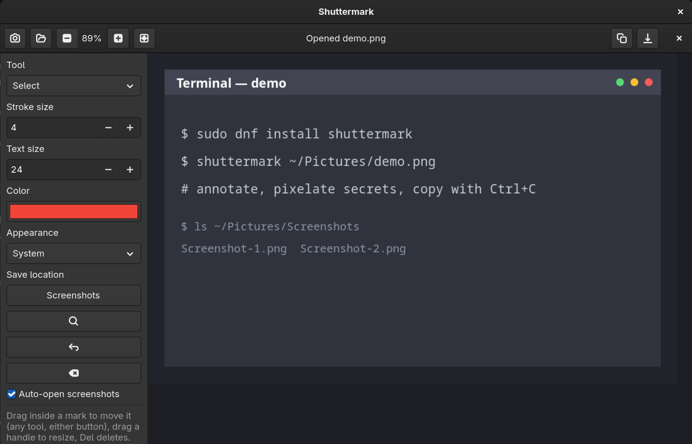

# Shuttermark

A focused screenshot and markup tool for GNOME on Wayland
(Fedora, Ubuntu, Arch, and other recent GNOME setups).

## Screenshots



## What it does

- Captures an interactive region via the desktop portal and GNOME
  Shell's Wayland-native screenshot flow, with a
  `gnome-screenshot -a` fallback where still available
- Opens existing PNG/JPEG/WebP images for annotation
- Draws freehand strokes, arrows, rectangles, ellipses, text, true
  pixelation and translucent highlights
- The **Select** tool (the default) moves marks by dragging the body,
  resizes via the square handles, and deletes with `Del` or the
  **Delete** button; `Ctrl+Z` undoes
- Right-drag moves a mark in any tool; hold `Shift` while drawing to
  start a new shape on top of an old one instead of moving it
- Drag the square handles around a selection to resize it (text
  scales its font size); the cursor shows the drag direction
- Clicking an OCR highlight with Select removes just that box
  (`Clear marks` removes everything)
- Arrow keys nudge the selection (`Shift` for bigger steps), `Tab`
  cycles through marks, `Ctrl+D` duplicates the selection
- Runs local OCR with Tesseract and places word-level highlight boxes
  over recognised text
- Copies a rendered PNG to the clipboard (`image/png`) or exports a PNG
- Keeps everything local; there is no upload or account

## Install

Fedora:
```bash
sudo dnf install python3-gobject python3-cairo gtk4 tesseract
```

Ubuntu / Debian:
```bash
sudo apt install python3-gi python3-gi-cairo gir1.2-gtk-4.0 python3-cairo tesseract-ocr
```

Arch:
```bash
sudo pacman -S python-gobject python-cairo gtk4 tesseract
```

`tesseract` is only needed for OCR (add language packs such as
`tesseract-langpack-deu` when required). `gnome-screenshot` is only a
fallback on older sessions.

To install the app itself:

```bash
install -Dm755 shuttermark.py ~/.local/bin/shuttermark
install -Dm644 io.github.byanurag.shuttermark.desktop ~/.local/share/applications/io.github.byanurag.shuttermark.desktop
install -Dm644 io.github.byanurag.shuttermark.svg ~/.local/share/icons/hicolor/scalable/apps/io.github.byanurag.shuttermark.svg
update-desktop-database ~/.local/share/applications 2>/dev/null || true
```

System-wide:

```bash
sudo install -Dm755 shuttermark.py /usr/local/bin/shuttermark
sudo install -Dm644 io.github.byanurag.shuttermark.desktop /usr/local/share/applications/io.github.byanurag.shuttermark.desktop
sudo install -Dm644 io.github.byanurag.shuttermark.svg /usr/local/share/icons/hicolor/scalable/apps/io.github.byanurag.shuttermark.svg
```

## Run

```bash
python3 shuttermark.py
# or, after install:
shuttermark
```

Use **Capture region** to start. GNOME controls the selection overlay, which is
important on Wayland. Shortcuts: `Ctrl+S` save, `Ctrl+C` copy,
`Ctrl+Z` undo, `Ctrl+D` duplicate, `Del` delete selection,
arrows nudge, `Tab` cycles marks, `Esc` deselect, `F9` toggles the sidebar.

Text labels use the **Text size** control, render above busy
backgrounds with a soft shadow, and support multiple lines. Click an
existing label with the Text tool — or double-click it with Select —
to edit it.

Images open zoomed to fit so the whole screenshot is visible
(annotations still export at full resolution) and stay fitted when
you resize the window — until you zoom manually. Use **+ / −** or
`Ctrl+=` / `Ctrl+-` to zoom, the **Fit** button or `Ctrl+0` to fit
again.


You can also open any image directly (PNG, JPEG, or WebP):

```bash
shuttermark ~/Pictures/example.png
```

or right-click an image in Files → **Open With → Shuttermark**.

## Appearance

The **Appearance** menu in the sidebar follows your GNOME theme by
default (**System**). Pick **Light** or **Dark** to override it; the
choice is remembered in `~/.config/shuttermark/settings.ini`.

## Save location

The **Save location** button in the sidebar shows where exports go
(`~/Pictures` to start). Click it to pick another folder — the export
dialog opens there next time, and whichever folder you last export to
becomes the new default.

## Notes on Wayland

The app deliberately does not use `xwd`, ImageMagick display grabbing, or
other X11 assumptions. It captures through the XDG screenshot portal and
GNOME Shell's native flow (`InteractiveScreenshot`), which is integrated
with the compositor. A small `gnome-screenshot` fallback remains for
older setups.

## License

GPL-3.0-or-later (`SPDX-License-Identifier: GPL-3.0-or-later`), see `LICENSE`.

## Contributing

Bug reports and small pull requests welcome. Check with
`python3 -m py_compile shuttermark.py` before submitting. By
contributing you agree your changes will be released under
the same GPL-3.0-or-later license.
